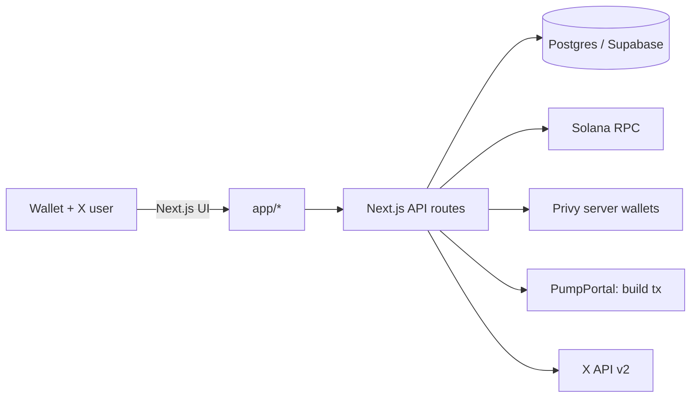

# AmpliFi


AmpliFi is a creator growth protocol for Solana that turns organic social engagement into rewards.

Creators launch a token, start campaigns, and fund reward pools. Holders (raiders) connect X, participate, and claim payouts. The app includes admin tooling for launch operations and a vanity mint worker for fast AMP-suffix launches.


## Table of contents

- [Product](#product)
- [Key routes](#key-routes)
- [Architecture](#architecture)
- [Tech stack](#tech-stack)
- [Getting started](#getting-started)
- [Environment variables](#environment-variables)
- [Background workers](#background-workers)
- [Admin tools](#admin-tools)
- [Deployment](#deployment)
- [Troubleshooting](#troubleshooting)
- [Security and custody](#security-and-custody)
- [Operations](#operations)

## Product

- **Token launch (Pump.fun)**
  - Guided launch flow with optional AMP vanity suffix.
  - Uses server-side signing (Privy) plus Solana RPC submission.
- **Campaigns**
  - Configure tracking handles/hashtags and epoch-based reward settlement.
  - Rewards can be viewed in dashboards and leaderboards.
- **Raider (holder) dashboard**
  - Connect wallet + verify X account.
  - View claimable rewards and claim via on-chain transactions.
- **Creator dashboard**
  - View launches/projects.
  - Claim creator-side rewards supported by the current integration.
- **Admin operations**
  - Vanity mint pool status + top-up triggers.
  - Clear launch history for an admin wallet (for test iteration).

Note: Bags UI is currently hidden/disabled.

## Key routes

- **Landing**: `/`
- **Launch**: `/launch`
- **Creator dashboard**: `/creator`
- **Raider dashboard**: `/holder`
- **Campaigns**: `/campaigns`
- **Leaderboards**: `/leaderboard`
- **Admin**: `/admin`

## Architecture

High level flow:



Data storage:

- Campaign state and engagement accounting live in Postgres via Supabase migrations in `supabase/migrations/`.
- Launch operations and vanity mint pool also use Postgres.

## Tech stack

- **Web**: Next.js 14 (App Router), React 18, TypeScript
- **Styling**: TailwindCSS
- **Solana**: `@solana/web3.js`, Solana Wallet Adapter
- **Server wallet signing**: Privy server wallets
- **Database**: Postgres (Supabase recommended)
- **Media**: Remotion (optional scripts)

## Repo structure

- `app/`
  - Next.js App Router pages and API routes
- `app/lib/`
  - Core protocol and integration logic
- `supabase/migrations/`
  - Postgres schema for campaigns, epochs, engagement, and payouts
- `workers/`
  - Background workers (vanity mint pool)
- `public/`
  - Static assets (branding, token images)

## Getting started

### Prerequisites

- Node.js `>= 20.18.0`
- Postgres database (Supabase recommended)
- A reliable Solana RPC for production

### Install

```bash
npm install
```

### Common scripts

```bash
npm run dev
npm run build
npm run start
npm run vanity-worker
```

### Configure environment

Create `.env.local` at the repo root:

Windows (PowerShell):

```bash
copy .env.example .env.local
```

macOS/Linux:

```bash
cp .env.example .env.local
```

Then fill in values (see [Environment variables](#environment-variables)).

### Database migrations

Migrations live in `supabase/migrations/`.

Apply them using one of these approaches:

- **Supabase Dashboard**
  - Open SQL Editor and run the migrations in order.
- **psql (direct connection)**
  - Run each file in order:

```bash
psql "$DATABASE_URL" -f supabase/migrations/0011_amplifi_init.sql
psql "$DATABASE_URL" -f supabase/migrations/0012_twitter_oauth.sql
psql "$DATABASE_URL" -f supabase/migrations/0013_amplifi_profiles_payouts.sql
psql "$DATABASE_URL" -f supabase/migrations/0014_twitter_rate_limits.sql
psql "$DATABASE_URL" -f supabase/migrations/0015_manual_lockup.sql
```

### Run the app

```bash
npm run dev
```

Open http://localhost:3000

## Environment variables

The full list is documented in `.env.example`. These are the most important groups.

### Required for most environments

- `DATABASE_URL`
- `SOLANA_RPC_URL`
- `ADMIN_WALLET_PUBKEYS`

### Required for Pump.fun launch signing

- `PRIVY_APP_ID`
- `PRIVY_APP_SECRET`
- `PRIVY_AUTHORIZATION_PRIVATE_KEY`

### Recommended for production

- `APP_ORIGIN` (admin endpoints require a valid Origin)
- `AUDIT_WEBHOOK_URL` (optional alerting)
- `PG_POOL_MAX`, `PG_POOL_CONNECTION_TIMEOUT_MS`, `PG_POOL_IDLE_TIMEOUT_MS` (if tuning connections)

### X integration

- `TWITTER_CLIENT_ID`
- `TWITTER_CLIENT_SECRET`
- `TWITTER_CALLBACK_URL`
- `TWITTER_BEARER_TOKEN` (optional)

### Vanity mint pool

- `VANITY_WORKER_SUFFIX` (must be `AMP`)
- `VANITY_WORKER_MIN_AVAILABLE` (default: 10)
- `VANITY_WORKER_TARGET_AVAILABLE` (default: 50)
- `VANITY_WORKER_IDLE_SLEEP_MS` (default: 30000)

## Background workers

### Vanity mint worker

This worker keeps a pool of AMP-suffix mint keypairs topped up in Postgres so launches do not block on vanity generation.

```bash
npm run vanity-worker
```

## Admin tools

Admin UI: `/admin`

- **Admin login**
  - Connect wallet
  - Sign once to create an admin session cookie
- **Vanity mint pool**
  - View pool size and trigger top-ups
- **Clear launch history**
  - Archives the current wallet's managed launch records for test iteration

## Deployment

This repo includes `netlify.toml` for Next.js deployments via Netlify.

- Build: `npm run build`
- Start: `npm run start`

You can also deploy to Vercel or any Node hosting that supports Next.js.

## Troubleshooting

### Launch fails

Common causes:

- Privy misconfiguration (missing auth key)
- RPC instability or rate limiting
- PumpPortal request failures
- Vanity pool is low (AMP mints depleted)

### Admin endpoints return 403

- Check `APP_ORIGIN` in production.
- Ensure requests originate from the correct site origin.

### Database errors

- Verify `DATABASE_URL`.
- Ensure migrations are applied.

## Security and custody

- Client wallets sign user actions (wallet adapter).
- Privy server wallets are used for specific server-side signing flows.
- Secrets must never be committed. Use `.env.local` and your hosting provider's secret store.

## Operations

See `RUNBOOK.md` for operational guidance (secrets, monitoring, incident response).
