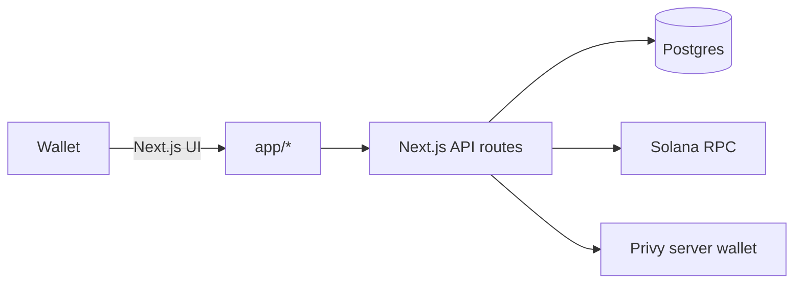

# HODLR

<div align="center">
  
</div>

HODLR is a Solana holder rewards app.


## Table of contents

- [Product](#product)
- [Key routes](#key-routes)
- [Architecture](#architecture)
- [Tech stack](#tech-stack)
- [Repo structure](#repo-structure)
- [Getting started](#getting-started)
- [Environment variables](#environment-variables)
- [Deployment](#deployment)
- [Cron jobs](#cron-jobs)
- [Operations](#operations)

## Product

- **Holder rewards**
  - Weekly epochs.
  - Snapshot holder balances and holding duration.
  - Rank top holders deterministically.
  - Allocate SOL distributions and allow eligible holders to claim.

## Key routes

- **Home**: `/`
- **Board**: `/board`
- **Leaderboards**: `/leaderboards`
- **Distributions**: `/distributions`
- **Claims**: `/claims`
- **Docs**: `/docs`

## Architecture

High level flow:



Data storage:

- HODLR epochs, snapshots, rankings, distributions, and claim records live in Postgres.

## Tech stack

- **Web**: Next.js 14 (App Router), React 18, TypeScript
- **Styling**: TailwindCSS
- **Solana**: `@solana/web3.js`, Solana Wallet Adapter
- **Server wallet signing**: Privy server wallets
- **Database**: Postgres (Supabase recommended)
- **Media**: Remotion (optional scripts)

## Repo structure

- `app/`
  - Next.js App Router pages and API routes
- `app/lib/`
  - Core protocol and integration logic

Note: legacy folders and files from the original codebase may still exist in the repo, but are not part of the HODLR product surface.

## Getting started

### Prerequisites

- Node.js `>= 20.18.0`
- Postgres database (Supabase recommended)
- A reliable Solana RPC (use separate server vs browser keys in production)

### Install

```bash
npm install
```

### Common scripts

```bash
npm run dev
npm run build
npm run start
npm run lint
```

### Configure environment

Create `.env.local` at the repo root:

Windows (PowerShell):

```bash
copy .env.example .env.local
```

macOS/Linux:

```bash
cp .env.example .env.local
```

Then fill in values (see [Environment variables](#environment-variables)).

### Database migrations

HODLR tables are created automatically on first use by `ensureHodlrSchema()`.

### Run the app

```bash
npm run dev
```

Open http://localhost:3000

## Environment variables

The canonical list is in `.env.example`. This section summarizes the important groups.

Tip: the app supports comma separated RPC lists for fallback.

### Browser (NEXT_PUBLIC_*)

- `NEXT_PUBLIC_SOLANA_CLUSTER` (recommended: `mainnet-beta`)
- `NEXT_PUBLIC_SOLANA_RPC_URLS` (recommended) or `NEXT_PUBLIC_SOLANA_RPC_URL` (optional)
  - Use a browser safe RPC key with allowed origins set for your domains.

### Server (Next.js API routes)

#### Required for most environments

- `DATABASE_URL`
- `SOLANA_RPC_URLS` (recommended) or `SOLANA_RPC_URL`

#### Strongly recommended in production

- `ESCROW_DB_SECRET` (required in production, encrypts escrow secrets at rest)

### Required for escrow signing

- `PRIVY_APP_ID`
- `PRIVY_APP_SECRET`
- `PRIVY_AUTHORIZATION_PRIVATE_KEY` (or `PRIVY_AUTHORIZATION_PRIVATE_KEYS` comma separated)

### Cron + automated operations

- `CRON_SECRET` (required to call cron endpoints)


### Recommended for production observability and stability

- `PG_POOL_MAX`, `PG_POOL_CONNECTION_TIMEOUT_MS`, `PG_POOL_IDLE_TIMEOUT_MS` (if tuning connections)

## Deployment

Recommended: deploy on Vercel.

- Set all required env vars in the Vercel project settings.

Netlify is also supported via `netlify.toml`.

- Build: `npm run build`
- Start: `npm run start`

You can also deploy to Vercel or any Node hosting that supports Next.js.

## Cron jobs

All cron endpoints require one of:

- Header `x-cron-secret: $CRON_SECRET`, or
- Header `authorization: Bearer $CRON_SECRET`

HODLR cron endpoints:

- `POST /api/cron/hodlr-snapshot`
- `POST /api/cron/hodlr-rank`
- `POST /api/cron/hodlr-distribution-dry-run`
- `POST /api/cron/hodlr-advance`
- `POST /api/cron/hodlr-claim-open?epochId=...`
- `POST /api/cron/hodlr-claim-close?epochId=...`

## Operations

See `RUNBOOK.md` for operational guidance (secrets, monitoring, incident response).
